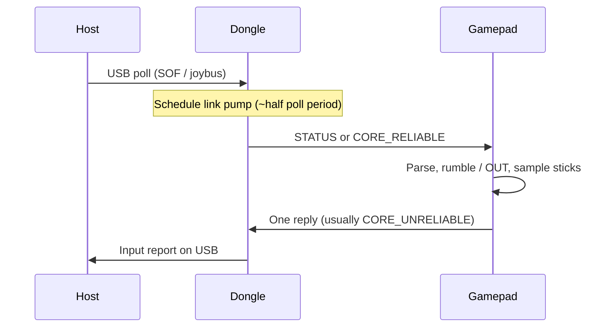
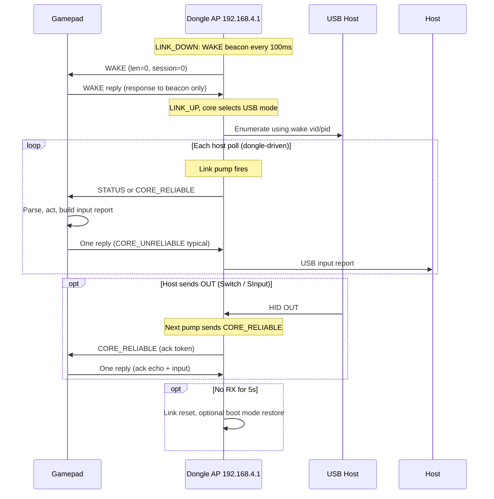

# HOJA Dongle — Gamepad WLAN Implementation Guide

This document describes how **gamepad firmware** connects to the HOJA wireless dongle, exchanges input with the USB host, and receives rumble/status. The canonical wire types live in [`include/dongle.h`](../include/dongle.h).

The dongle runs a small **UDP protocol** over a private Wi‑Fi AP. Every datagram payload is exactly one `dongle_pkt_s` structure (fixed size). There is no framing beyond UDP.

**Golden rule: the gamepad never sends UDP proactively.** Every `dongle_pkt_s` the gamepad transmits must be a **response** to a packet the dongle just sent (WAKE beacon, STATUS, or CORE_RELIABLE). There is no gamepad-initiated keepalive, no background input stream, and no “push WAKE on a timer.” Bind UDP, wait for dongle RX, then reply once.

While connected, input rate follows the **USB host** (dongle link pump), not a gamepad-local timer. See §3.

---

## 1. Network setup

| Parameter | Value |
|-----------|--------|
| Wi‑Fi SSID | `HOJA_WLAN_1234` (see dongle firmware; may change per product) |
| Wi‑Fi password | `HOJA_1234` |
| Security | WPA2-PSK (AES) |
| AP IP (dongle) | `192.168.4.1` |
| Gamepad IP (DHCP reservation) | `192.168.4.16` |
| Subnet mask | `255.255.255.0` |
| UDP port (both directions) | `4444` (`DONGLE_WLAN_PORT`) |

**Gamepad responsibilities**

1. Join the dongle AP as a Wi‑Fi station.
2. Obtain DHCP (expect address `192.168.4.16` — the dongle DHCP server is configured for this host).
3. Bind UDP port `4444` and **wait for dongle packets** (do not transmit until the dongle sends first).
4. When replying, send to `192.168.4.1:4444` — one datagram per dongle datagram received.

**Dongle RX filter**

The dongle **only accepts** UDP packets where:

- Source IP is `192.168.4.16` (`DONGLE_GAMEPAD_IP*`)
- Source port is `4444`
- Payload length is **exactly** `sizeof(dongle_pkt_s)`

Packets from any other endpoint are dropped.

---

## 2. Wire format: `dongle_pkt_s`

```c
typedef struct {
    uint16_t session;   // Packed dongle_session_s (see below)
    uint16_t ack;       // Reliable-layer echo (see §5)
    uint8_t  id;        // dongle_pid_t
    uint16_t len;       // Valid bytes in data[]
    uint8_t  data[64];  // Payload
} dongle_pkt_s;
```

**Rules**

- Always transmit the **full** `sizeof(dongle_pkt_s)` bytes. Zero-fill bytes beyond `len`.
- `len` must be `<= 64`. The dongle clamps outbound copies to 64 bytes.
- `session` must be set on **every** gamepad-originated packet after you start a session (see session identity below).
- Treat `ack` as required in each **reply** when the dongle has set `rx.ack` on `CORE_RELIABLE` (see §6).

### Session identity (`dongle_session_s`)

Each time the gamepad starts a **new logical session** (cold boot, reconnect after timeout, or deliberate re-pair), it picks a new **session id**: a random value in `1 … 0xFFF` (12 bits). That id is **not** the USB product id; `vid` / `pid` in WAKE are separate.

| Where | Field | Role |
|-------|--------|------|
| Every `dongle_pkt_s` | `session` (packed) | `mode` (4 bits) + `id` (12 bits) — tags all traffic for this session |
| WAKE payload | `dongle_wake_s.session` | Same layout as packed `session` — **must equal** `pkt->session` on that WAKE packet |
| WAKE payload | `dongle_wake_s.vid` / `pid` | USB descriptors for the dongle to expose |

**Why the dongle cares**

- A **new** `session.id` (or changed WAKE body) tells the dongle a new client attached or the gamepad rebooted → run `core_init` again from WAKE.
- While the link stays up, the dongle **dedupes** identical WAKE (same packed `session` and same `dongle_wake_s` bytes) so periodic re-WAKE does not re-enumerate USB.

**Gamepad algorithm** (call when building a WAKE **reply** to a dongle beacon, not on a timer):

```c
void gamepad_prepare_wake_reply(dongle_mode_t mode, uint16_t vid, uint16_t pid,
                                dongle_pkt_s *tx)
{
    uint16_t sid = (uint16_t)(random() & 0xFFFu);
    if (sid == 0) sid = 1;

    _wake.session.mode = mode;
    _wake.session.id   = sid;
    _wake.vid          = vid;
    _wake.pid          = pid;

    tx->session = dongle_session_pack(&_wake.session);
    /* fill *tx id/len/data as WAKE reply — udp_send only after RX beacon */
}
```

After reboot or WLAN timeout, use a **new** random `sid` the next time you **reply** to a dongle WAKE beacon.

### Packed `session` field (wire)

Packed into the 16-bit `session` field (little-endian bitfield layout):

| Field | Width | Meaning |
|-------|-------|---------|
| `mode` | 4 bits | `dongle_mode_t` — USB personality for this session |
| `id` | 12 bits | Session id (must match `dongle_wake_s.session.id` on WAKE) |

```c
typedef struct {
    uint16_t mode : 4;
    uint16_t id   : 12;
} dongle_session_s;
```

Use `dongle_session_pack()` / `dongle_session_unpack()` from `dongle.h` (bitfield copy via `memcpy` to `uint16_t`).

### Packet IDs (`dongle_pid_t`)

| ID | Name | Direction (typical) | Purpose |
|----|------|-------------------|---------|
| `0` | `DONGLE_PID_WAKE` | Dongle → gamepad (beacon); gamepad → dongle (**reply only**) | Mode selection / USB VID-PID |
| `1` | `DONGLE_PID_CORE_RELIABLE` | Dongle → gamepad; gamepad → dongle (**reply only**) | Ordered tunnel (host OUT / feature IN) |
| `2` | `DONGLE_PID_CORE_UNRELIABLE` | Gamepad → dongle (**reply only**) | Input report in response to STATUS / reliable |
| `3` | `DONGLE_PID_STATUS` | Dongle → gamepad | Rumble, brakes, connection flags |

---

## 3. Respond-only pacing (how input is timed)

The dongle **paces** gamepad input off the **USB host poll rate** (USB SOF / joybus timing). The gamepad is **purely reactive**: it never originates WLAN traffic.

| Allowed | Not allowed |
|---------|-------------|
| Reply once after each dongle UDP RX | Transmit without receiving a dongle packet first |
| Reply to WAKE beacon with WAKE body | Periodic WAKE or input on a local timer |
| Reply to STATUS with input | “Background” `CORE_UNRELIABLE` between dongle polls |

**Rule: one gamepad UDP reply for every dongle UDP packet you receive — and no gamepad UDP otherwise.**

```text
Dongle → gamepad   (always first)
Gamepad            parse → act → build one reply → send
Gamepad → dongle   exactly one dongle_pkt_s (never otherwise)
```

That reply is how the dongle gets the next input sample for the host. Missing a reply stalls the host; **any proactive gamepad TX is a protocol error**.

### What the dongle sends (link up)

On each **link pump** (scheduled from the host side, up to ~500 Hz), core1 sends **one** of:

| Priority | `id` | Meaning |
|----------|------|---------|
| 1 | `DONGLE_PID_CORE_RELIABLE` | Host OUT data waiting for your `ack` |
| 2 | `DONGLE_PID_STATUS` | `dongle_status_u` (rumble, brakes, player, connection) |

While **link down**, the dongle sends empty **WAKE beacons** (`len == 0`) about every 100 ms.

### What you send back (one packet each time)

| Received from dongle | Handle on gamepad | Your reply (typical) |
|----------------------|-------------------|----------------------|
| `DONGLE_PID_WAKE`, `len == 0` (beacon) | Start / refresh session | **One** `DONGLE_PID_WAKE` with `dongle_wake_s` (new random session `id` on first join) |
| `DONGLE_PID_STATUS` | Apply `dongle_status_u` (rumble, etc.) | **One** `DONGLE_PID_CORE_UNRELIABLE` with the **current** input report for your mode |
| `DONGLE_PID_CORE_RELIABLE` | Handle host OUT in `data`; copy `rx.ack` into your echo variable | **One** reply that sets `ack = rx.ack` (see §6). Usually `CORE_UNRELIABLE` with input; use `CORE_RELIABLE` only when you have feature/command IN data for the host |

Always set `session` on every reply. Set `ack` to the dongle’s outstanding reliable token when `rx.ack != 0` (see §6).

### Recommended RX handler shape

```c
void on_dongle_udp(const dongle_pkt_s *rx)
{
    dongle_pkt_s tx;
    memset(&tx, 0, sizeof(tx));

    tx.session = pack_session(&_session);
    if (rx->ack != 0)
        _ack_echo = rx->ack;
    tx.ack = _ack_echo;

    switch ((dongle_pid_t)rx->id)
    {
    case DONGLE_PID_WAKE:
        if (rx->len == 0)
            build_wake_reply(&tx);           /* beacon → WAKE body */
        break;

    case DONGLE_PID_STATUS:
        apply_status((const dongle_status_u *)rx->data);
        build_input_report(&tx);             /* CORE_UNRELIABLE */
        break;

    case DONGLE_PID_CORE_RELIABLE:
        handle_host_out(rx->data, rx->len);
        build_input_report(&tx);             /* and/or CORE_RELIABLE IN if needed */
        break;

    default:
        return;                              /* dongle sent nothing we answer — do not TX */
    }

    udp_send_to_dongle(&tx);                 /* only path that may transmit */
}
```

`udp_send_to_dongle()` must **only** be called from this handler (or functions it calls immediately after a dongle RX). No other task, timer, or thread may send WLAN packets.

Process each dongle datagram **synchronously**: one RX → at most one TX. Never transmit without a current dongle RX context.

### Pacing diagram (steady state)



---

## 4. Connection flow



### Step-by-step (gamepad)

1. **Associate** to the dongle AP and get `192.168.4.16`.
2. **Bind UDP and wait** — do not transmit until the dongle sends a packet (while link down, only **WAKE beacons** from the dongle).
3. **Reply to each WAKE beacon** with **one** WAKE response carrying a **new random session id** and USB identity:

```c
typedef struct {
    dongle_session_s session; /* mode (4) + id (12) — must match pkt->session */
    uint16_t vid;
    uint16_t pid;
} dongle_wake_s;
```

Example packet (session id `0x3A7` chosen at random):

- `id` = `DONGLE_PID_WAKE`
- `len` = `sizeof(dongle_wake_s)`
- `session` = `dongle_session_pack(&(dongle_session_s){ .mode = DONGLE_MODE_XINPUT, .id = 0x3A7 })`
- `data` = `dongle_wake_s` with the **same** `.session`, plus `vid`, `pid`

4. After the dongle accepts your WAKE **reply**, USB comes up. From then on, **only respond** to dongle packets (§3).
5. On each **`DONGLE_PID_STATUS`**: apply rumble, **reply** with **one** `CORE_UNRELIABLE` input report.
6. On each **`DONGLE_PID_CORE_RELIABLE`**: handle host OUT, **reply** with **one** packet that echoes `ack` (usually plus input).
7. The 5 s link watchdog is refreshed by your **replies**, not by unsolicited traffic (§9).

**Duplicate WAKE**

While the link stays up, the dongle ignores repeated WAKE **replies** with the **same** packed `session` and the **same** `dongle_wake_s` body. You may send the same WAKE again only as **another reply** to a new dongle beacon (e.g. retry).

After disconnect or timeout, pick a **new random session id** in the WAKE body the next time you **reply** to a dongle WAKE beacon.

---

## 5. Mode selection (`dongle_mode_t`)

| Mode | Value | Dongle USB core | Typical `CORE_UNRELIABLE` payload |
|------|-------|-----------------|-----------------------------------|
| Switch Pro | `DONGLE_MODE_SWITCH` (0) | Switch / NS HID | 64 bytes — Switch input report |
| SInput | `DONGLE_MODE_SINPUT` (1) | Vendor HID | 64 bytes — input report id `0x02` |
| XInput | `DONGLE_MODE_XINPUT` (2) | XInput | 20 bytes |
| Slippi | `DONGLE_MODE_SLIPPI` (3) | GC adapter USB | Up to 37 bytes (GC USB report) |
| SNES | `DONGLE_MODE_SNES` (4) | *Not implemented on dongle* | — |
| N64 | `DONGLE_MODE_N64` (5) | Joybus N64 | `sizeof(core_n64_report_s)` (4 bytes) |
| GameCube | `DONGLE_MODE_GAMECUBE` (6) | Joybus GC | `sizeof(core_gamecube_report_s)` (8 bytes) |

Set `dongle_wake_s.vid` / `dongle_wake_s.pid` to the USB descriptors you want the dongle to present (Switch core applies them on WAKE).

**Mode or session change**

To switch USB mode or force a full re-init, **reply** to a dongle WAKE beacon with WAKE containing a **new random session id** and updated `mode` / `vid` / `pid`. Some dongle mode pairs require a reboot when switching between two non‑N64 USB personalities; plan for a full reconnect.

---

## 6. Reliable channel and `ack`

The dongle uses `pkt->ack` as a **16-bit token** for host→gamepad **CORE_RELIABLE** delivery.

**Dongle → gamepad (reliable OUT)** — each transmission expects **one** gamepad reply (see §3).

1. Dongle sets `id = DONGLE_PID_CORE_RELIABLE`, puts host OUT bytes in `data`, `len` = OUT length.
2. Dongle sets `ack` to a **new random** value (never repeats the previous token).
3. Dongle may **retransmit** the same reliable packet until your reply echoes that `ack`; **each retransmit still expects one reply**.

**Gamepad → dongle (your reply to any dongle RX while link up)**

- In that **single** reply packet, set `ack` to the token from the dongle’s `CORE_RELIABLE` you are answering (`rx.ack`).
- When `ack` matches what the dongle expects, it clears that OUT and may send the next queued host packet on a later pump.

**Do not** rely on a later unprompted packet to echo `ack` — echo it in the **immediate** response to that dongle datagram.

**Ack-only replies**

If you have no new stick data but must answer a `CORE_RELIABLE` retransmit, you may reply with `len == 0` and the correct `ack`. Prefer including a fresh `CORE_UNRELIABLE` input report whenever possible so the host stays paced.

**Gamepad → dongle (reliable IN)**

Use `DONGLE_PID_CORE_RELIABLE` in a **reply** when you have feature/command IN data for the host (e.g. SInput). Include `ack = rx.ack` when answering a dongle reliable OUT.

---

## 7. Input path: `CORE_UNRELIABLE`

- **When to send:** Only inside your dongle RX handler (§3) — never proactively.
- **What to send:** The current input report for your `dongle_mode_t` (see §5 table): `id = DONGLE_PID_CORE_UNRELIABLE`, `len` = report size, bytes in `data`.
- **Dongle behavior:** Latest report wins (snapshot); the host only sees input when the dongle has received your reply and run its USB path.

Do **not** drive `CORE_UNRELIABLE` from a local periodic timer. Do **not** send WLAN packets except as replies to the dongle.

---

## 8. Output path: `DONGLE_PID_STATUS`

Payload is `dongle_status_u` (`len == 8`):

```c
typedef union {
    struct {
        uint8_t connection;      // dongle_connection_t
        uint8_t player_number;
        struct { uint8_t left, right; } rumble;
        struct { uint8_t left, right; } brake;
    };
    uint64_t value;
} dongle_status_u;
```

| `connection` | Meaning |
|--------------|---------|
| `DONGLE_CONN_IDLE` (0) | WLAN link down or not yet paired from gamepad perspective |
| `DONGLE_CONN_CONNECTED` (1) | Dongle has received gamepad traffic (link up) |

Map `rumble` / `brake` to your motors, then send your **one** reply for that STATUS (§3). Treat STATUS rate as host-poll-limited (dongle pump capped ~500 Hz).

---

## 9. Timeouts and keepalive

| Constant | Value | Effect |
|----------|-------|--------|
| `HDONGLE_TIMEOUT_US` | 5 s | No valid gamepad UDP → dongle resets WLAN link |
| WAKE beacon interval | 100 ms | Dongle broadcasts empty WAKE while link down |

**Keepalive:** Only your **replies** refresh the watchdog. There is no separate keepalive transmit. If the host stops polling, the dongle stops sending and the gamepad correctly stays silent until the next dongle RX.

---

## 10. Reference state machine (gamepad)

```
OFFLINE
  → WiFi associated, UDP bound, no TX
WAIT_DONGLE
  → blocked until dongle UDP RX (WAKE beacon while link down)
ACTIVE
  → on each dongle RX: parse → act → exactly one reply (§3)
  → never TX without RX
  → on 5s without dongle driving replies: link down → WAIT_DONGLE
```

**Suggested persistent variables**

- `dongle_session_s session` — current `mode` + 12-bit session `id`
- `uint16_t wake_session_id` — same 12-bit value as `dongle_wake_s.session.id` (optional mirror)
- `uint16_t ack_echo` — last ack token required by dongle (from last RX)
- `dongle_status_u status` — last rumble/command snapshot
- Input report buffer sized per mode (≤ 64 bytes)

---

## 11. Minimal bring-up checklist

- [ ] Join `HOJA_WLAN_1234` / obtain `192.168.4.16`
- [ ] UDP bind port `4444`; destination `192.168.4.1:4444` for **replies only**
- [ ] TX/RX buffers are exactly `sizeof(dongle_pkt_s)`
- [ ] **Never transmit** except as a reply to a dongle RX (§3)
- [ ] UDP bind only until first dongle packet; first TX is WAKE **reply** to beacon
- [ ] First WAKE reply: new random session `id` (1…0xFFF), `session.id` matches, `vid`/`pid` set
- [ ] STATUS → rumble applied → one `CORE_UNRELIABLE` reply
- [ ] CORE_RELIABLE → host OUT handled → one reply with `ack = rx.ack`

---

## 12. Common mistakes

| Symptom | Likely cause |
|---------|----------------|
| Dongle never enumerates USB | Never **replied** to WAKE beacon, bad WAKE `len`, wrong IP/port, or payload size ≠ `sizeof(dongle_pkt_s)` |
| No traffic at all | Gamepad TX without dongle RX first (protocol violation) or wrong destination |
| Input stutter / wrong rate | Proactive `CORE_UNRELIABLE` on a timer instead of reply-only pacing |
| USB works, no rumble | Not handling STATUS in the RX path, or not sending a reply (dongle still sent STATUS) |
| Stuck after host OUT | No **immediate** reply to `CORE_RELIABLE` with `ack = rx.ack` |
| Random disconnect ~5 s | Not replying to dongle packets (wrong source IP must be `.16`), or host idle so no pumps |
| Two inputs per host frame | Sending multiple gamepad UDPs for one dongle RX |
| Mode wrong on host | `dongle_wake_s.session` ≠ packed `pkt->session`, or duplicate WAKE ignored (same session + body) |
| Dongle does not re-init after reboot | Reused previous session `id`; must pick a new random id after reboot |

---

## 13. Library integration

Add `HOJA-LIB-DONGLE` to your gamepad project and include `dongle.h` for shared constants and structs. This repository’s `dongle.c` is intentionally empty — **you implement** UDP send/recv and the state machine on your platform (lwIP, CYW43, etc.).

For dongle-side behavior (AP setup, pump timing, USB cores), see `src/hdongle.c` in the `hoja-dongle-fw` repository.

---

## Revision

Document version matches dongle firmware in `hoja-dongle-fw` (host-paced link pump, one gamepad reply per dongle TX, `dongle_pkt_s` fixed size). If SSID/credentials or IP layout change in firmware, update §1 accordingly.
