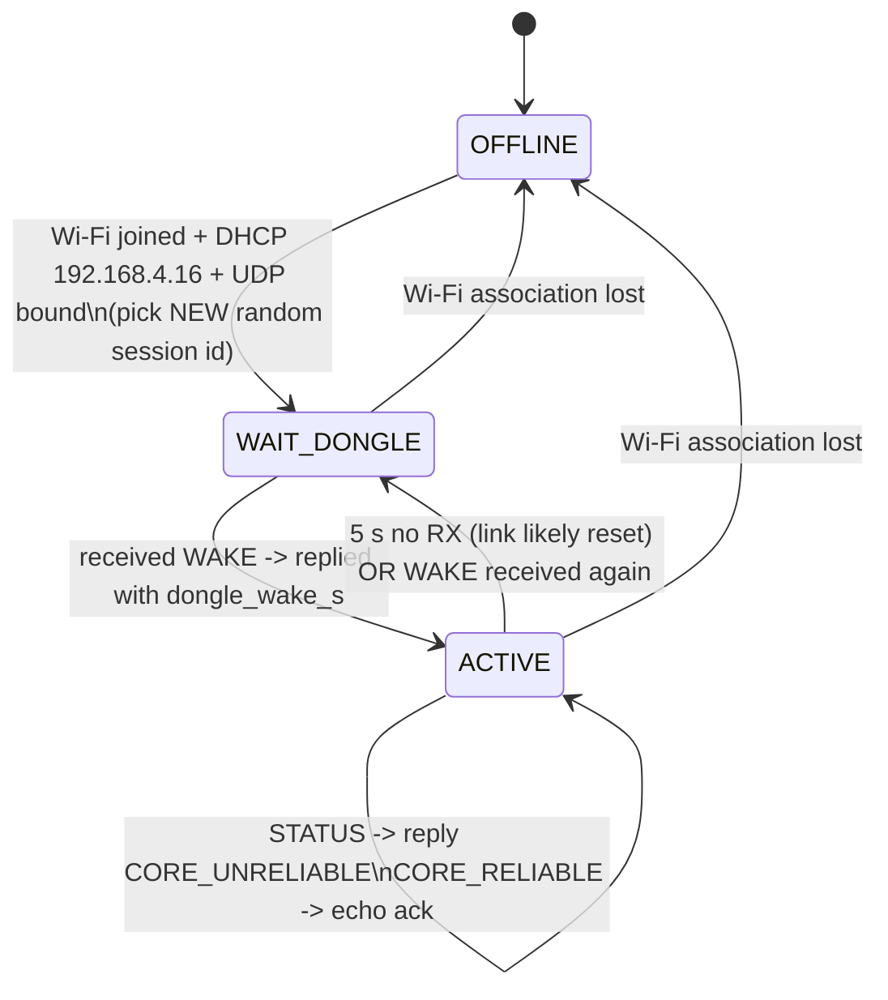

# HOJA Wireless Dongle — Gamepad-Side Implementation Guide

This document describes **exactly** what the **gamepad** firmware (e.g. a Pico-W controller)
must do to talk to the HOJA wireless dongle. It is the authoritative reference for the
**gamepad side** of the link.

The wire types are defined in [`include/dongle.h`](../include/dongle.h). The dongle-side
behavior this guide mirrors lives in:

- [`src/core1wlan.c`](../../../src/core1wlan.c) — WLAN engine: AP/DHCP/UDP, link state machine, WAKE beacons, reliable ACK lane, link pump, RX filter.
- [`src/core0transport.c`](../../../src/core0transport.c) — status snapshot + WAKE/STATUS/RELIABLE/UNRELIABLE processing.

> All struct field names, enum values, constants, IPs/ports, and timeouts in this guide are
> quoted from the firmware. Do **not** invent fields. If the code and this doc ever disagree,
> the code wins — fix the doc.

---

## 1. Overview & the golden rule

The dongle is a Wi-Fi **Access Point**. It enumerates as a USB/Joybus controller to a host
console and tunnels that traffic over UDP to/from one gamepad. The gamepad is a Wi-Fi
**station** that joins the dongle's AP, takes a DHCP-reserved IP, and exchanges fixed-size
UDP datagrams with the dongle.

### THE GOLDEN RULE — the gamepad is RESPOND-ONLY

**The gamepad MUST NEVER transmit a UDP datagram proactively.** Every packet the gamepad
sends is **exactly one reply** to a packet the dongle just sent it (a WAKE beacon, a STATUS
packet, or a CORE_RELIABLE packet).

- **One dongle RX → at most one gamepad TX.**
- There is **no gamepad-side send timer.** Input pacing is driven entirely by the dongle's
  host-poll-rate **link pump**. When the console polls the dongle, the dongle sends the
  gamepad a packet; the gamepad replies with its latest input. If the console is slow, the
  gamepad is slow. If the console polls at 500 Hz, the gamepad replies up to ~500 Hz.
- The **only** code path allowed to call `udp_send` is the UDP receive handler
  (`on_dongle_udp()` in this guide). If you find yourself sending from a timer, an input
  ISR, or a main-loop tick, you are violating the protocol.

This model keeps the gamepad perfectly in lockstep with console demand, eliminates buffer
bloat, and means "replying" is also the only keepalive (see §12).

---

## 2. Network setup & the dongle RX filter

The dongle runs the AP, a DHCP server, and a single UDP socket. The endpoints are fixed and
shared via `dongle.h`:

| Parameter        | Value                | Source |
|------------------|----------------------|--------|
| SSID             | `HOJA_WLAN_1234`     | `WIFI_SSID_BASE` (`core1wlan.c`) |
| Passphrase       | `HOJA_1234`          | `WIFI_PASS` (`core1wlan.c`) |
| Auth             | WPA2-AES PSK         | `CYW43_AUTH_WPA2_AES_PSK` |
| AP channel       | 6                    | `cyw43_wifi_ap_set_channel(..., 6)` |
| AP / dongle IP   | `192.168.4.1`        | `IP4_ADDR(&ap_ip, 192,168,4,1)` |
| Gamepad IP       | `192.168.4.16`       | `DONGLE_GAMEPAD_IP0..3` |
| UDP port         | `4444` (both ways)   | `DONGLE_WLAN_PORT` / `DONGLE_GAMEPAD_PORT` |

```c
/* From dongle.h — use these exact values on the gamepad. */
#define DONGLE_WLAN_PORT   4444u
#define DONGLE_GAMEPAD_IP0 192u
#define DONGLE_GAMEPAD_IP1 168u
#define DONGLE_GAMEPAD_IP2 4u
#define DONGLE_GAMEPAD_IP3 16u
#define DONGLE_GAMEPAD_PORT DONGLE_WLAN_PORT
```

### The dongle RX filter — why the gamepad must use the reserved IP

The dongle's lwIP receive callback (`_c1_udp_rx_cb`) **drops** any datagram that does not
satisfy **both** of these checks:

1. **Length** — `p->tot_len == sizeof(dongle_pkt_s)`. Wrong-size datagrams are freed and
   ignored before they ever reach the state machine.
2. **Source** — the source address/port must match the gamepad endpoint
   (`_c1_gamepad_addr_matches`: `port == DONGLE_GAMEPAD_PORT && ip_addr_cmp(addr, &_gamepad_addr)`),
   where `_gamepad_addr` is the fixed `192.168.4.16`.

**Implications for the gamepad:**

- Accept the DHCP-offered lease, which the dongle reserves as `192.168.4.16`. If your station
  ends up on any other address, **every packet you send is silently dropped.**
- Always send **from** UDP port `4444` **to** `192.168.4.1:4444`.
- Always send/receive **exactly `sizeof(dongle_pkt_s)` bytes** per datagram (see §3).

---

## 3. Wire format: `dongle_pkt_s`

Every datagram in **both** directions is a single, fixed-size, **packed** `dongle_pkt_s`:

```c
#pragma pack(push, 1)
typedef struct
{
    uint16_t session;   // dongle_session_s (packed; see §4)
    uint16_t ack;       // Reliable packet ACK token (see §9)
    uint8_t  id;         // dongle_pid_t (see §5)
    uint16_t len;       // Used length of data[] (0..64)
    uint8_t  data[64];   // Payload container
} dongle_pkt_s;
#pragma pack(pop)
```

### Hard rules

- **`#pragma pack(push,1)` is mandatory.** The gamepad's struct MUST be byte-identical to
  this layout. With 1-byte packing, `sizeof(dongle_pkt_s)` is **71 bytes**
  (2 + 2 + 1 + 2 + 64). If your compiler inserts padding (e.g. you forget the pragma), the
  size mismatches and **the dongle's length filter silently drops every packet you send.**
  This was a real bug — see §15.
- **Always transmit the full `sizeof(dongle_pkt_s)`**, not just `8 + len`. The dongle copies
  the entire structure; partial datagrams fail the length filter.
- **Zero-fill before populating.** `memset(&pkt, 0, sizeof(pkt))` so unused `data[]` bytes,
  `ack`, etc. are deterministic.
- **`len` must be `0..64`.** The dongle clamps to `sizeof(pkt.data)` on its side, but you
  should never set `len > 64`.
- **All multi-byte fields are little-endian** (both ends are ARM Cortex-M0+, LE). No byte
  swapping is required between two LE peers.

---

## 4. Session identity: `dongle_session_s` / `dongle_wake_s`

The **gamepad owns the session.** The dongle simply copies whatever `session` value it last
received from the gamepad into every outbound packet (`_c1_session_unpack(pkt->session, &sm->session)`),
and core 0 keys controller (re)initialization off the session value inside WAKE replies.

### `dongle_session_s` — packed 16-bit bitfield

```c
#pragma pack(push, 1)
typedef struct
{
    uint16_t mode : 4; // dongle_mode_t (see §8)
    uint16_t id   : 12; // Random session id; new value per session / reboot
} dongle_session_s;
#pragma pack(pop)
```

This is the meaning of the 16-bit `pkt->session` field. Pack/unpack with the provided
inline helpers (they `memcpy` between the bitfield struct and a `uint16_t`):

```c
uint16_t dongle_session_pack(const dongle_session_s *s);
void     dongle_session_unpack(uint16_t packed, dongle_session_s *s);
```

### Choosing the session id

- On **cold boot** and on **every reconnect**, the gamepad MUST pick a **new random 12-bit
  `id`** (`0x000`–`0xFFF`).
- The low 4 bits (`mode`) select the controller personality the dongle should present to the
  console (see §8).
- **Do not reuse the previous session id after a reboot.** The dongle's core 0 only
  re-initializes the USB/Joybus core when the WAKE `session` value *changes*
  (`_c0_process_wake`: `if (tmp.session != _this_wake.session)`). If you reboot and resend the
  same session value, the dongle thinks nothing changed and **won't re-enumerate** — your
  controller never comes up. See §15.

### `dongle_wake_s` — the WAKE reply payload

```c
#pragma pack(push, 1)
typedef struct
{
    uint16_t session; // The PACKED dongle_session_s value (same u16 as pkt->session)
    uint16_t vid;     // USB vendor id for enumeration
    uint16_t pid;     // USB product id for enumeration
} dongle_wake_s;
#pragma pack(pop)
```

> **Note:** `dongle_wake_s.session` is the **packed `uint16_t`** (identical to `pkt->session`),
> **not** a nested `dongle_session_s` struct. Set it to the same packed value you put in
> `pkt->session`.

`vid` / `pid` are the USB vendor/product IDs the dongle advertises when it enumerates to the
host (used by USB cores such as XInput/Switch/SInput). The gamepad supplies them in its WAKE
reply; the dongle stores them in `_this_wake` and passes them to `core_init()`.

---

## 5. Packet IDs: `dongle_pid_t`

```c
typedef enum
{
    DONGLE_PID_WAKE = 0,          // Dongle is awaiting traffic from the gamepad (beacon)
    DONGLE_PID_CORE_RELIABLE,     // = 1  Reliable tunnel data (command replies, etc.)
    DONGLE_PID_CORE_UNRELIABLE,   // = 2  High-rate input reports
    DONGLE_PID_STATUS,            // = 3  Carries dongle_status_u (rumble/link/transport/...)
    DONGLE_PID_BULK_UNRELIABLE,   // = 4  RESERVED (webUSB bulk tunnel) — not yet fleshed out
    DONGLE_PID_CONFIG_RELIABLE,   // = 5  RESERVED (config bulk endpoint) — not yet fleshed out
} dongle_pid_t;
```

| ID | Name | Direction(s) used | Gamepad action |
|----|------|-------------------|----------------|
| 0 | `DONGLE_PID_WAKE` | Dongle→gamepad beacon; gamepad→dongle reply | Reply with a `dongle_wake_s` payload (session/vid/pid) |
| 1 | `DONGLE_PID_CORE_RELIABLE` | Dongle→gamepad (host OUT, ack'd); gamepad→dongle (IN replies / ack) | Echo `ack`, apply OUT payload, optionally return reliable IN data |
| 2 | `DONGLE_PID_CORE_UNRELIABLE` | Gamepad→dongle (input reports) | Send latest input report in reply to a STATUS/poll |
| 3 | `DONGLE_PID_STATUS` | Dongle→gamepad | Apply `dongle_status_u` (rumble/brake/link/transport/player), then reply with input |
| 4 | `DONGLE_PID_BULK_UNRELIABLE` | (reserved) | **Ignore for now** |
| 5 | `DONGLE_PID_CONFIG_RELIABLE` | (reserved) | **Ignore for now** |

> **Reserved IDs:** `DONGLE_PID_BULK_UNRELIABLE` and `DONGLE_PID_CONFIG_RELIABLE` exist in the
> enum and the dongle has stub plumbing for them (`core0_send_reliable_configreport`,
> a bulk snapshot), but the endpoints are **not yet fleshed out**. A reliable configuration
> bulk endpoint is planned. The gamepad can safely ignore these IDs today.

---

## 6. The respond-only pacing model

### What the dongle sends, and when

The dongle's TX is split into two regimes by its link state machine (`c1_link_t`):

| Dongle link state | What the dongle transmits | Rate |
|-------------------|---------------------------|------|
| `C1_LINK_DOWN` | Empty **WAKE** beacons (`DONGLE_PID_WAKE`, `len == 0`) | every `C1_WAKE_INTERVAL_US` ≈ **100 ms** |
| `C1_LINK_UP` | A **link pump** tick: if a reliable OUT is inflight, resend that **CORE_RELIABLE**; else a **STATUS** packet | driven by host poll rate, capped at ~**500 Hz** (`C1_LINK_PUMP_MIN_INTERVAL_US` ≈ 1900 µs) |

The dongle **never** sends `CORE_UNRELIABLE` to the gamepad; that PID is gamepad→dongle only.
While link-up, the steady-state dongle→gamepad packet is **STATUS** (every pump tick where no
reliable OUT is pending). Each STATUS therefore doubles as the "give me your latest input" poll.

### What the gamepad replies with

| Dongle sends... | Gamepad replies with... |
|-----------------|--------------------------|
| `WAKE` (beacon, while link-down) | one `WAKE` packet carrying `dongle_wake_s` (session/vid/pid) |
| `STATUS` | apply the status, then one `CORE_UNRELIABLE` packet with the latest input report |
| `CORE_RELIABLE` (host OUT) | echo `rx.ack`; apply the OUT payload; reply with either a `CORE_RELIABLE` IN (with data) or an **ack-only** packet (`len == 0`) |

### Recommended RX-handler skeleton — the ONLY place that transmits

```c
/*
 * Called once per received UDP datagram. This is the ONLY function permitted
 * to transmit. It produces at most one TX per RX. No timers, no proactive sends.
 */
void on_dongle_udp(const uint8_t *buf, uint16_t buf_len)
{
    /* 1. Length filter mirrors the dongle: reject anything not packet-sized. */
    if (buf_len != sizeof(dongle_pkt_s))
        return;

    dongle_pkt_s rx;
    memcpy(&rx, buf, sizeof(rx));   /* struct is packed; safe to copy in */

    dongle_pkt_s tx;
    memset(&tx, 0, sizeof(tx));
    tx.session = dongle_session_pack(&g_session); /* our owned session value */

    switch (rx.id)
    {
        case DONGLE_PID_WAKE:
            /* Dongle is beaconing for us. Reply with our identity to bring the link up. */
            g_state = STATE_ACTIVE;            /* first contact */
            tx.id  = DONGLE_PID_WAKE;
            {
                dongle_wake_s w;
                w.session = dongle_session_pack(&g_session);
                w.vid     = g_vid;
                w.pid     = g_pid;
                tx.len = sizeof(w);
                memcpy(tx.data, &w, sizeof(w));
            }
            udp_send_to_dongle(&tx);
            break;

        case DONGLE_PID_STATUS:
            /* Apply rumble/brake/link/transport/player, then answer with input. */
            if (rx.len == sizeof(dongle_status_u))
            {
                dongle_status_u st;
                memcpy(&st, rx.data, sizeof(st));
                apply_status(&st);             /* rumble/brake/leds; see §11 */
            }
            tx.id  = DONGLE_PID_CORE_UNRELIABLE;
            tx.len = build_input_report(tx.data, &g_session); /* latest snapshot */
            tx.ack = rx.ack;                   /* harmless to echo; keeps reliable lane happy */
            udp_send_to_dongle(&tx);
            break;

        case DONGLE_PID_CORE_RELIABLE:
            /* Host OUT report (rumble subcommand, feature request, etc.). */
            apply_reliable_out(rx.data, rx.len);
            tx.ack = rx.ack;                   /* MUST echo to retire the dongle's inflight */
            if (have_reliable_in())            /* e.g. SInput features response */
            {
                tx.id  = DONGLE_PID_CORE_RELIABLE;
                tx.len = build_reliable_in(tx.data);
            }
            else
            {
                tx.id  = DONGLE_PID_CORE_UNRELIABLE; /* or ack-only: id=CORE_RELIABLE,len=0 */
                tx.len = build_input_report(tx.data, &g_session);
            }
            udp_send_to_dongle(&tx);
            break;

        default: /* BULK_UNRELIABLE, CONFIG_RELIABLE, unknown */
            break;                              /* ignore; do NOT transmit */
    }
}
```

---

## 7. Connection flow

```mermaid
sequenceDiagram
    participant GP as Gamepad (192.168.4.16)
    participant DG as Dongle AP (192.168.4.1)
    participant HOST as Console / USB host

    Note over GP,DG: GP cold boot: pick new random 12-bit session id + mode
    GP->>DG: Join SSID HOJA_WLAN_1234 (WPA2-AES)
    DG-->>GP: DHCP lease 192.168.4.16

    Note over DG: link = C1_LINK_DOWN — beacons only
    loop every ~100 ms while link down
        DG->>GP: WAKE beacon (id=0, len=0)
    end

    GP->>DG: WAKE reply (id=0, dongle_wake_s = session/vid/pid)
    Note over DG: First valid RX -> link = C1_LINK_UP<br/>session copied; core0 sees new session -> core_init(vid/pid)
    DG->>HOST: Enumerate as selected controller (USB/Joybus)

    loop steady state (host-poll-paced, <=500 Hz)
        DG->>GP: STATUS (id=3, dongle_status_u)
        GP->>DG: CORE_UNRELIABLE (id=2, latest input report)
    end

    opt host sends an OUT report (rumble subcommand, etc.)
        DG->>GP: CORE_RELIABLE (id=1, ack=token, payload)
        GP->>DG: reply echoing ack (CORE_RELIABLE IN data, or ack-only len=0)
        Note over DG: ack matches expected -> retire inflight
    end
```

### Step-by-step

1. **Join the AP.** Connect to `HOJA_WLAN_1234` / `HOJA_1234` (WPA2-AES) and accept the DHCP
   lease (`192.168.4.16`). Open a UDP socket bound to port `4444`.
2. **Pick a fresh session.** On cold boot/reconnect, choose a new random 12-bit `id` and set
   `mode` to the desired `dongle_mode_t`.
3. **Wait for a WAKE beacon.** Do not transmit until the dongle sends you something.
4. **Reply to WAKE** with a `dongle_wake_s` (your packed session + vid/pid). This first valid
   RX promotes the dongle to `C1_LINK_UP` and, because the session value changed, triggers
   `core_init()` so the dongle enumerates to the console.
5. **Steady state.** Respond to each STATUS with your latest input report. Apply incoming
   status (rumble/brake/leds). Respond to CORE_RELIABLE OUTs by echoing the ack.
6. **Keep replying.** Your replies are the only keepalive; stop replying for 5 s and the
   dongle tears the link down (§12).

---

## 8. Mode selection & input report sizes

Set `dongle_session_s.mode` (the low 4 bits of `pkt->session`) to one of:

```c
typedef enum
{
    DONGLE_MODE_SWITCH   = 0,
    DONGLE_MODE_SINPUT   = 1,
    DONGLE_MODE_XINPUT   = 2,
    DONGLE_MODE_SLIPPI   = 3,
    DONGLE_MODE_SNES     = 4,   // NOT implemented on the dongle
    DONGLE_MODE_N64      = 5,
    DONGLE_MODE_GAMECUBE = 6,
} dongle_mode_t;
```

The `mode` you select determines what input-report layout the dongle expects in your
`CORE_UNRELIABLE` payloads. The dongle's active core only consumes an unreliable packet when
`pkt.len` matches its expected report size exactly (or, for Slippi, copies up to its size):

| `dongle_mode_t` | Dongle core | Expected `CORE_UNRELIABLE` payload | Size source |
|-----------------|-------------|-------------------------------------|-------------|
| `SWITCH` (0)    | Switch Pro USB | **64 bytes** | literal `64` / `CORE_REPORTFORMAT_SWPRO` (`core_switch.c`) |
| `SINPUT` (1)    | SInput USB HID | **64 bytes** | `SINPUT_REPORT_LEN_INPUT` (`core_sinput.c`) |
| `XINPUT` (2)    | XInput USB     | **20 bytes** | `XINPUT_REPORT_LEN` (`core_xinput.c`) |
| `SLIPPI` (3)    | GC adapter USB | **up to 37 bytes** | `slippi_report_s.report[37]` (`core_slippi.c`) |
| `SNES` (4)      | — | **not implemented on the dongle** | — |
| `N64` (5)       | N64 Joybus     | **4 bytes** (`core_n64_report_s`) | `CORE_N64_REPORT_SIZE` (`core_n64.h`) |
| `GAMECUBE` (6)  | GC Joybus      | **8 bytes** (`core_gamecube_report_s`) | `CORE_GAMECUBE_REPORT_SIZE` (`core_gamecube.h`) |

> Most cores (N64, GameCube, XInput, SInput) only accept an unreliable packet whose `pkt.len`
> **exactly** matches the expected report size; a mismatched packet is dropped and the dongle
> keeps presenting its previous report, so your inputs are ignored. (The Switch core copies
> whatever length it receives, but the host still expects the full 64-byte report.) Always send
> the exact size for the mode you selected.

---

## 9. Reliable channel & ack token semantics

The reliable lane carries **host → gamepad OUT** reports (rumble subcommands, SInput feature
requests, etc.). It is a single-inflight, stop-and-wait, ack'd channel **owned by the dongle**:

- When the host produces an OUT report, core 0 queues it and core 1 assigns a **random 16-bit
  `ack` token** (`_c1_reliable_assign_ack`, always distinct from the previous token) and moves
  to `C1_RELIABLE_AWAIT_ACK`.
- While awaiting, **every link pump tick resends the same `CORE_RELIABLE` packet** with the
  same `ack` token (`_c1_send_inflight_reliable`) — STATUS is suppressed until the ack is
  retired.
- The dongle retires the inflight packet only when it receives a gamepad packet whose
  `pkt->ack` **equals** the expected token (`_c1_reliable_on_ack`: matches `expected_ack`).
  Any gamepad packet can carry the ack — the dongle checks `pkt->ack` on **every** RX.

### What the gamepad must do

- **Echo `rx.ack` in your immediate reply** to a `CORE_RELIABLE` packet. Until you echo it,
  the dongle keeps resending the same OUT and **won't deliver any new OUT or STATUS**.
- The reply may carry reliable IN data (`id = DONGLE_PID_CORE_RELIABLE`, `len > 0`), or it may
  be an **ack-only** packet (`len == 0`). Ack-only replies are valid: the dongle ignores
  empty payloads for everything except WAKE (`_c1_rx_consume`: `if (pkt->len == 0 && pkt->id != DONGLE_PID_WAKE) continue;`),
  so an empty packet still updates the ack and the link watchdog without being forwarded to
  core 0 as data.
- Because the same OUT may be **resent** (the dongle can't tell your ack was lost), make
  `apply_reliable_out()` **idempotent** where it matters, or de-dup on the token.
- Setting `tx.ack = rx.ack` on **any** reply (even a STATUS reply / input report) is harmless
  and robust — it opportunistically retires whatever the dongle currently has inflight.

> **Gamepad → dongle reliable IN:** A `CORE_RELIABLE` packet from the gamepad with `len > 0`
> is queued by core 0 (`_c0_process_reliable` → `core0_reliable` FIFO) and surfaced to the
> active core (e.g. SInput consumes it as a one-shot features report). Use this for replies the
> host explicitly requested.

---

## 10. Input path: `CORE_UNRELIABLE`

This is the high-rate gamepad → dongle lane for live input.

- Send a `CORE_UNRELIABLE` packet (`id = DONGLE_PID_CORE_UNRELIABLE`) **only as a reply** to a
  dongle packet (normally a STATUS poll).
- The dongle stores it as a **latest-wins snapshot** (`core0_send_pkt` →
  `snapshot_core0_unreliable_write`). There is no queue and no ordering guarantee: only the
  newest report matters. The active core reads it on demand when the console polls
  (`core0_get_unreliable_inputreport`, or the merged `core0_get_inputreport` for cores like
  Switch that also accept a queued reliable IN report).
- Always send your **freshest** input state. Don't try to "catch up" by sending multiple
  reports — newer overwrites older, and you can only send one per RX anyway.
- The payload is the mode-specific input report from §8. Match the expected size exactly
  (Slippi: up to 37 bytes).

---

## 11. Output path: `STATUS` (`dongle_status_u`)

The dongle's link-up steady-state packet is `STATUS`, carrying a packed `dongle_status_u`:

```c
#pragma pack(push, 1)
typedef union
{
    struct
    {
        uint8_t link_status;       // dongle_link_status_t
        uint8_t transport_status;  // dongle_transport_status_t
        uint8_t player_number;
        struct { uint8_t left; uint8_t right; } rumble;
        struct { uint8_t left; uint8_t right; } brake;
    };
    uint64_t value;                // union overlay => sizeof == 8, len == 8
} dongle_status_u;
#pragma pack(pop)
#define DONGLE_STATUS_U_LEN sizeof(dongle_status_u)  // == 8
```

A STATUS packet has `pkt.len == sizeof(dongle_status_u)` (**8**). The gamepad should validate
`rx.len == sizeof(dongle_status_u)` before copying.

### The two status fields (this replaces the old single `connection` field)

The old single connection field is **gone**. There are now **two independent** status fields:

```c
typedef enum { DONGLE_LINK_DOWN = 0, DONGLE_LINK_UP = 1 } dongle_link_status_t;
typedef enum { DONGLE_TRANSPORT_IDLE = 0, DONGLE_TRANSPORT_CONNECTED = 1 } dongle_transport_status_t;
```

- **`link_status`** — owned by the dongle's **WLAN core** (core 1). It reflects the
  **wireless link** only: `DONGLE_LINK_UP` once the dongle has heard from the gamepad,
  `DONGLE_LINK_DOWN` otherwise. Core 1 stamps this field into every outbound STATUS
  (`_c1_send_status`). If you're receiving STATUS, this will normally read `DONGLE_LINK_UP`.
- **`transport_status`** — owned by **core 0** and reflects whether the **console side** is
  actually connected: `DONGLE_TRANSPORT_CONNECTED` when the USB host has enumerated the dongle
  or the Joybus console is actively polling, `DONGLE_TRANSPORT_IDLE` otherwise
  (`core0_set_transport_status`).

> **Use `transport_status`, not `link_status`, to decide if you're truly "live" on the
> console.** The wireless link can be up while no console is present. Drive your "connected to
> console" LED / haptic feedback off `transport_status == DONGLE_TRANSPORT_CONNECTED`.

### Applying the rest

- **`rumble.left` / `rumble.right`** and **`brake.left` / `brake.right`** — drive your haptics.
  On the dongle these are set via `core0_set_rumble(left, right, brake_left, brake_right)`.
- **`player_number`** — the assigned player index; drive your player LEDs from it.

Apply STATUS first, **then** reply with your input report (see the §6 skeleton).

---

## 12. Timeouts & keepalive

- **Link timeout: 5 s.** If the dongle goes `C1_TIMEOUT_US` (5,000,000 µs = **5 s**) without a
  valid gamepad RX while link-up, it resets the link (`_c1_link_timed_out` → `_c1_reset_link`):
  clears the reliable lane, zeroes its session copy, drops back to `C1_LINK_DOWN`, and resumes
  WAKE beacons.
- **WAKE beacon interval: ~100 ms** (`C1_WAKE_INTERVAL_US`) while link-down.
- **Replies ARE the keepalive.** Because the gamepad is respond-only, the dongle's watchdog is
  refreshed every time you reply. As long as the dongle keeps polling (STATUS) and you keep
  replying, the link stays up. There is **no separate ping** to send.
- If the dongle is somehow not polling for >5 s, it will already have considered the link
  down — your job is simply to keep answering whatever it sends, and to answer the WAKE beacon
  again when the link comes back.
- After a link reset, the dongle's session copy is zeroed, so your next WAKE reply (with your
  current session) is treated as a fresh session and re-initializes the console core.

---

## 13. Reference gamepad state machine



| State | Meaning | Allowed TX |
|-------|---------|-----------|
| `OFFLINE` | Not associated / no IP | none |
| `WAIT_DONGLE` | Associated + IP, waiting for first dongle packet | only a reply to a received WAKE |
| `ACTIVE` | Link up, exchanging packets | exactly one reply per received packet |

### Suggested persistent variables

```c
typedef enum { STATE_OFFLINE, STATE_WAIT_DONGLE, STATE_ACTIVE } gp_state_t;

static gp_state_t       g_state;       // current state machine state
static dongle_session_s g_session;     // { mode, id } — id randomized per cold boot/reconnect
static uint16_t         g_vid, g_pid;  // advertised in WAKE replies
static dongle_status_u  g_last_status; // last applied status (rumble/transport/player)
// NOTE: no g_tx_timer — there is intentionally no proactive-send timer.
```

- Randomize `g_session.id` once at cold boot and again on each reconnect; never reuse the
  previous value across a reboot (§4, §15).
- Treat receipt of a WAKE beacon while in `ACTIVE` as "the dongle re-beaconed" — it's safe to
  re-send your WAKE reply.

---

## 14. Minimal bring-up checklist

1. [ ] `#include <dongle.h>`; confirm `sizeof(dongle_pkt_s) == 71` at compile time
       (`_Static_assert(sizeof(dongle_pkt_s) == 71, "packing");`).
2. [ ] Join `HOJA_WLAN_1234` / `HOJA_1234` (WPA2-AES), accept DHCP `192.168.4.16`.
3. [ ] Bind a UDP socket on port `4444`; register your RX callback.
4. [ ] Pick a **new random 12-bit** `g_session.id`; set `g_session.mode`.
5. [ ] In the RX callback only: reject `buf_len != sizeof(dongle_pkt_s)`.
6. [ ] On WAKE → reply with `dongle_wake_s` (packed session, vid, pid).
7. [ ] On STATUS → apply `dongle_status_u`; reply with one `CORE_UNRELIABLE` input report sized
       for your mode (§8).
8. [ ] On CORE_RELIABLE → echo `rx.ack`; apply OUT payload; reply (data or ack-only).
9. [ ] Confirm the dongle enumerates to the console and `transport_status` flips to
       `DONGLE_TRANSPORT_CONNECTED`.
10. [ ] Verify you never transmit except inside the RX callback (one TX per RX).

---

## 15. Common mistakes

| Mistake | Symptom | Fix |
|---------|---------|-----|
| Struct **not packed** (forgot `#pragma pack(push,1)`) | `sizeof` ≠ 71 → datagram length ≠ `sizeof(dongle_pkt_s)` → **dongle silently drops every packet** | Pack the struct identically; static-assert the size |
| Sending only `8 + len` bytes instead of the full struct | Length filter drops the datagram | Always send `sizeof(dongle_pkt_s)` |
| **Reusing the previous session id** after a reboot | Dongle sees an unchanged session, **skips `core_init()`**, never re-enumerates | Pick a **new** random 12-bit id on every cold boot/reconnect |
| Wrong source IP/port (not `192.168.4.16:4444`) | All gamepad packets dropped by the source filter | Use the DHCP-reserved IP; send from port 4444 to `192.168.4.1:4444` |
| **Proactive sends** (timer-driven TX, sending without an RX) | Floods / desyncs the host-paced pump; violates the protocol | Transmit **only** from the RX handler, one TX per RX |
| Not echoing `rx.ack` for CORE_RELIABLE | Dongle resends the same OUT forever; STATUS/new OUTs stall | Echo `rx.ack` in the immediate reply (or on any reply) |
| `CORE_UNRELIABLE` payload size ≠ mode's report size | Dongle ignores your input, repeats last report | Match the exact size for the selected `dongle_mode_t` (§8) |
| Using `link_status` to mean "connected to console" | LED lit even with no console attached | Use `transport_status == DONGLE_TRANSPORT_CONNECTED` |
| Non-idempotent `apply_reliable_out` | Double-applied OUT on ack loss/resend | De-dup on the ack token or make application idempotent |

---

## 16. Library integration note

- **Include `dongle.h`** ([`include/dongle.h`](../include/dongle.h)) for all shared wire types
  (`dongle_pkt_s`, `dongle_status_u`, `dongle_session_s`, `dongle_wake_s`, the enums, and the
  IP/port/PID constants). Both ends MUST compile against the same definitions.
- **`HOJA-LIB-DONGLE`'s `dongle.c` is intentionally minimal.** It does not implement the
  networking for you. The gamepad firmware implements the **UDP send/recv + state machine** on
  its own platform (e.g. lwIP / CYW43 on a Pico-W) following this guide.
- For the authoritative **dongle-side** behavior — the WLAN engine, link state machine, WAKE
  beacons, reliable ACK lane, link pump, and RX filter — read
  [`src/core1wlan.c`](../../../src/core1wlan.c). For status snapshotting and
  WAKE/STATUS/RELIABLE/UNRELIABLE processing, read
  [`src/core0transport.c`](../../../src/core0transport.c).

---

### Appendix: constants quick reference

| Constant | Value | Where |
|----------|-------|-------|
| `DONGLE_WLAN_PORT` | `4444` | `dongle.h` |
| Gamepad IP | `192.168.4.16` | `DONGLE_GAMEPAD_IP0..3` |
| Dongle/AP IP | `192.168.4.1` | `core1wlan.c` |
| `sizeof(dongle_pkt_s)` | `71` bytes | packed layout |
| `sizeof(dongle_status_u)` | `8` bytes | union with `uint64_t value` |
| `C1_WAKE_INTERVAL_US` | `100000` (~100 ms) | `core1wlan.c` |
| `C1_TIMEOUT_US` | `5000000` (5 s) | `core1wlan.c` |
| `C1_LINK_PUMP_MIN_INTERVAL_US` | `1900` (~500 Hz) | `core1wlan.c` |
